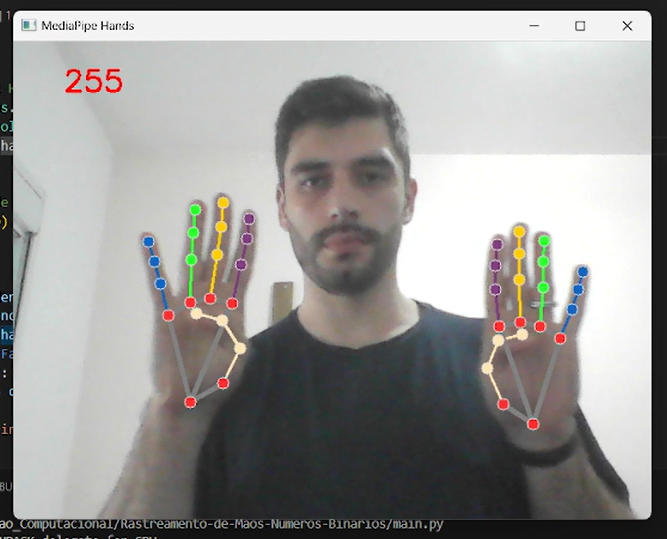
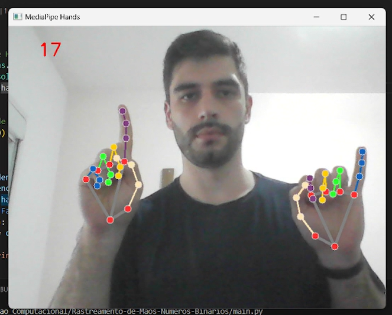
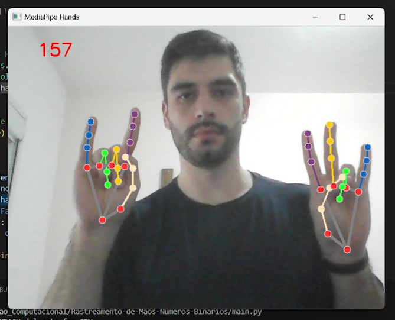
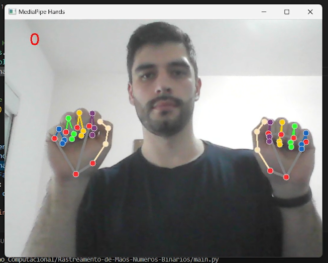

# Rastreamento de Mãos - Contagem Números Binários

Este é um projeto para demonstrar o uso do MediaPipe para rastrear as mãos e calcular um número binário com base na posição dos dedos.

Algumas imagens do projeto, mostrando parcialmente algumas telas:










## Instalação

1. Certifique-se de ter o Python instalado em seu sistema.

2. Crie um ambiente virtual (opcional, mas recomendado):
   ```bash
   python -m venv venv
   source venv/bin/activate  # Linux/macOS
   venv\Scripts\activate  # Windows

3. Instale as dependências do projeto usando 'pip':
    ```bash
    pip install -r requirements.txt

## Uso

Execute o script principal para iniciar o rastreamento das mãos:
   ```bash
    python main.py